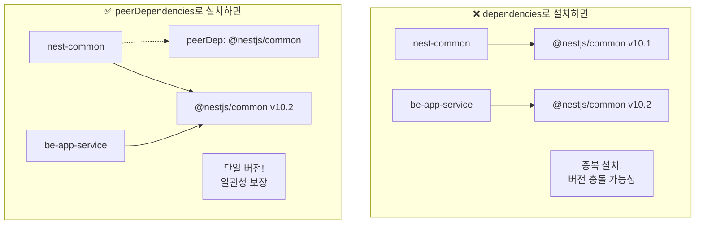
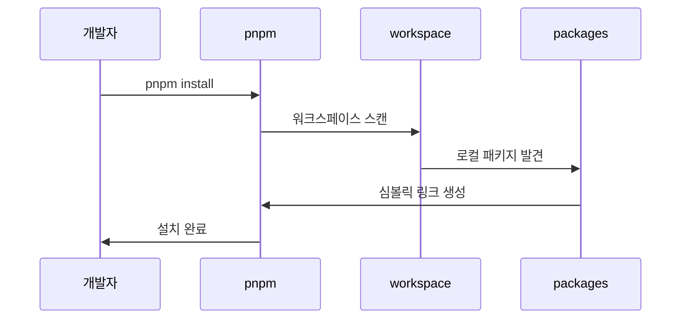

# Monorepo

## Workspace

여러 개의 패키지를 하나의 저장소에서 관리하는 방식.
일반적으로 기능은 apps, 공통 패키지는 packages 내부에 사용.

## 로컬 패키지

공통으로 사용할 패키지를 정의하고, 사용하는 워크스페이스에서 로컬 패키지를 가져옴.

```json
// packages/nest-common/package.json
{
  "name": "@${scopename}/nest-common"

  ...
}

// apps/be-app-service/package.json
{
  "dependencies": {
    "@${scopename}/nest-common": "workspace:*"
  }
}
```

같은 워크스페이스 내에서 정의한 로컬 패키지(`@${scopename}/nest-common` 등)를 `workspace:*` 문법으로 가져와 사용

## PeerDependencies

공통 패키지에서 필요한 외부 의존성들은 `peerDependencies`로 정의.

```json

// packages/nest-common/package.json
  "peerDependencies": {
    "@nestjs/common": "*",
    "@nestjs/core": "*",
    "class-transformer": "*",
    "class-validator": "*",
    "rxjs": "*"
  },
```

이는 해당 패키지가 `peerDependencies`에 정의된 패키지들이 있어야 동작한다고 명시하는 것.

실제 사용하는 `apps/*` 워크스페이스에서 이러한 의존성들을 설치하여 사용.

이를 통해 `packages/*` 공통 패키지와 `apps/*` 서비스에서 동일한 버전의 패키지를 사용할 수 있음.



## 패키지 설치 과정

`pnpm install` 명령어 실행 시 진행과정

1. 루트에서 모든 `package.json` 스캔

2. 공통 의존성은 루트 `node_modules`에 설치

3. 로컬 패키지들은 심볼릭 링크로 연결


