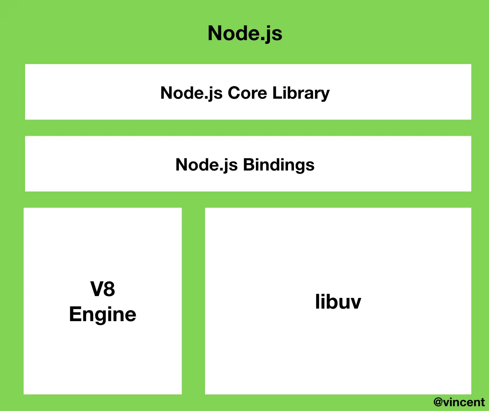
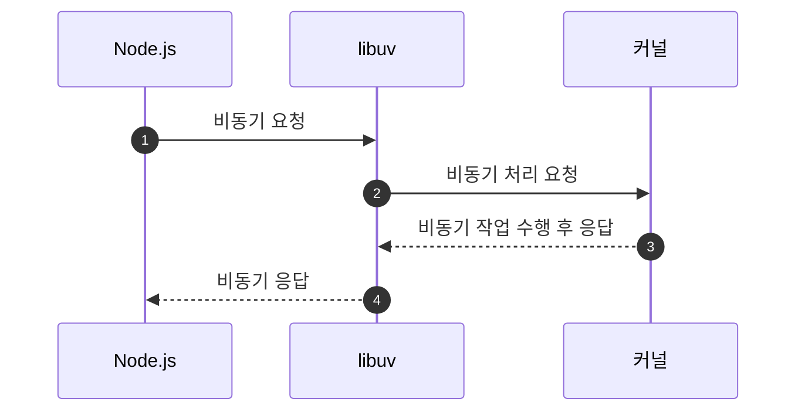
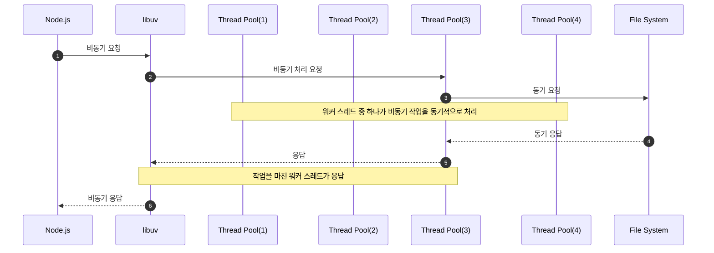
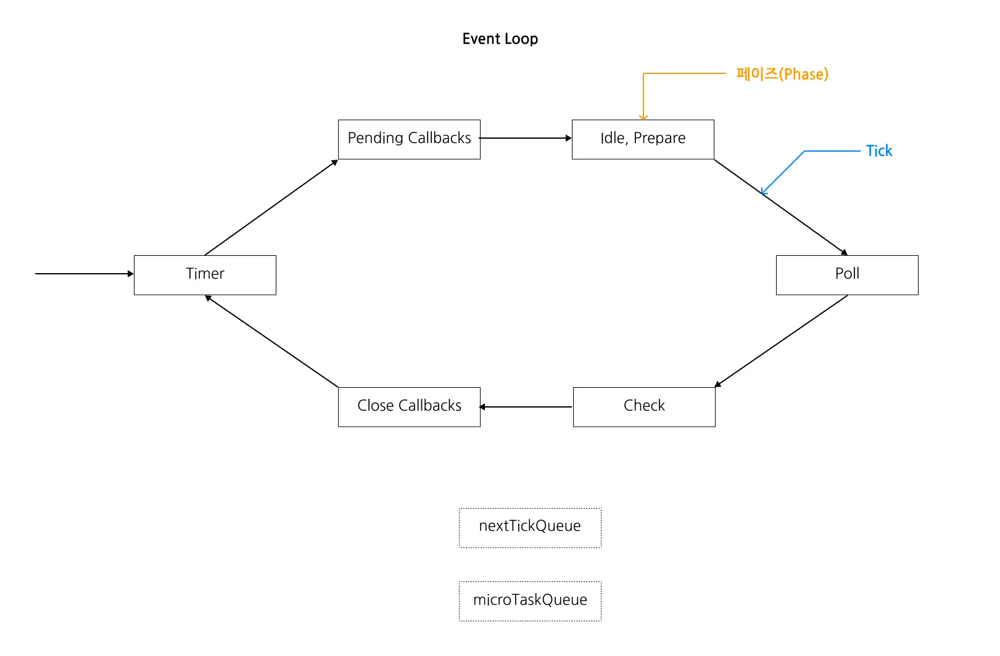
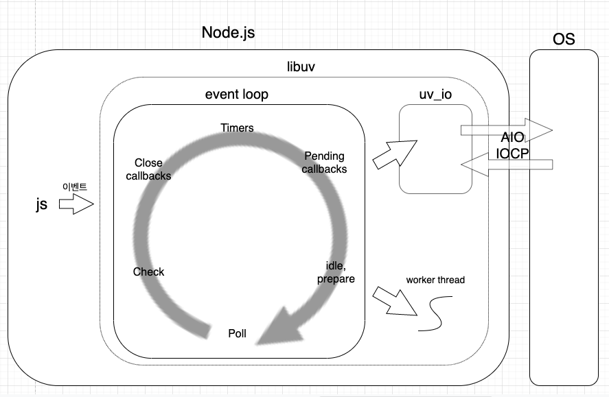

# Node.js의 동작 원리

---

Node.js는 하나의 스레드로 동작하지만 I/O 작업이 발생한 경우 이를 비동기적으로 처리할 수 있다.
하나의 스레드는 하나의 실행 흐름만을 가지고 있고 파일 읽기와 같이 기다려야 하는 작업을 실행하면 그 작업이 끝나기 전에는 아무것도 할 수 없어야만 한다.
Node.js는 하나의 스레드만으로 여러 비동기 작업들을 블로킹 없이 수행할 수 있고 그 기반에는 이벤트 루프가 존재한다.



-   Node.js는 c++로 작성된 런타임이다.
-   내부에는 V8 Engine과 libuv가 존재한다.

> libuv?
> c++로 작성된 비동기 I/O 라이브러리이다.
> 운영체제의 커널을 추상화한 Wrapping 라이브러리로 커널이 어떤 비동기 API를 지원하는지 알고 있다.

1. libuv에게 파일 읽기와 같은 비동기 작업을 요청하면 libuv는 이 작업을 커널이 지원하는지 확인한다.
2. libuv가 대신 커널에게 비동기적으로 요청했다가 응답이 오면 그 응답을 우리에게 전달해준다.
3. 커널이 지원하지 않는다면 자신만의 워커 스레드가 담긴 스레드 풀을 사용한다.



1. libuv는 기본적으로 4개의 스레드를 가지는 스레드 풀을 생성한다.(128개까지 늘릴 수 있다고 한다.)
2. 요청한 작업을 커널이 지원하지 않는다면 libuv는 커널을 호출하는 대신 이 스레드 풀에게 작업을 맡겨버린다.
3. 스레드 풀에 있는 스레드 중 하나가 작업을 동기적으로 처리한다.
4. 스레드가 작업을 완료하면 libuv가 요청한 작업이 완료되었다고 알려준다.



**Node.js는 I/O 작업을 libuv에게 위임함으로써 논 블로킹 I/O를 지원하고 그 기반에는 이벤트 루프가 있다.**

# 이벤트 루프

---



-   이벤트 루프는 Node.js가 비동기 작업을 관리하기 위한 구현체다.
-   이벤트 루프는 총 6개의 페이즈로 구성되어 있으며 한 페이즈에서 다음 페이즈로 넘어가는 것을 틱이라고 한다.
-   각 페이즈는 자신만의 큐를 관리한다.
-   Node.js는 순서대로 페이즈를 방문하면서 큐에 쌓인 작업을 하나씩 실행한다.
-   페이즈의 큐에 담긴 작업을 모두 실행하거나 시스템의 실행 한도에 다다르면 Node.js는 다음 페이즈로 넘어간다.
-   이벤트 루프가 살아있는 한 Node.js는 이벤트 루프를 반복한다.

# 이벤트 루프 작동 흐름

---

**setTimeout 예시**

```js
//test.js
setTimeout(() => console.log("Async Hello World"), 1000)
console.log("Hello World")
```

1. test.js 실행
2. 이벤트 루프 생성
3. 이벤트 루프 Timer 페이즈에 setTimeout 콜백 등록 `console.log("Async Hello World")`
4. 생성한 이벤트 루프에 진입 하지 않고 이벤트 루프 바깥에서 test.js를 처음부터 끝까지 실행(즉시 실행 가능한 작업들을 먼저 처리 `Hello World` 출력)
5. 이벤트 루프 잔여 작업 존재 확인 후 이벤트 루프 진입
6. Timer 페이즈에 진입했지만 1초가 지나지 않아 실행 준비가 안되었을 경우 다음 페이즈 이동
7. 모든 페이즈에 잔여 작업이 없으므로 계속 이동하며 다시 Timer 페이즈 진입
8. 1초가 지나 setTimeout으로 등록해뒀던 콜백이 실행 준비가 되었을 경우 Timer 페이즈가 관리하는 큐에서 콜백을 꺼내서 실행("Async Hello World" 출력)
9. Timer 페이즈내 잔여 작업이 없으므로 다음 페이즈 이동
10. 모든 페이즈에 잔여 작업이 없으므로 process.on('exit')의 콜백을 실행 후 이벤트 루프를 종료한 뒤 프로그램을 종료

> Timer Phase는 setTimeout(fn, 1000)을 호출했다고 하더라도 정확하게 1s가 지난 후에 fn이 호출됨을 보장하지 않는다. 1s가 흐르기 전에 실행되지 않는 것을 보장한다. 다르게 말하면 1초 이상의 시간이 흘렀을 때 fn이 실행됨을 보장한다.

**DB Read 예시**

```js
//db.js
db.query("select * from test", (data) => {
    console.log(data)
})
```

1. db.js 실행
2. 이벤트 루프 생성
3. libuv에서 `db.query(select * from test)` 해당 작업 커널 또는 워커 스레드 풀에 할당
4. 커널 또는 워커 스레드가 데이터베이스와 통신하며 쿼리 실행
5. 작업이 완료되면 이벤트 루프에 응답 후 Pool 페이즈 큐에 콜백함수로 등록 `console.log(data)`
6. 생성한 이벤트 루프에 진입 하지 않고 이벤트 루프 바깥에서 db.js를 처음부터 끝까지 실행(즉시 실행 가능한 작업들을 먼저 처리)
7. 이벤트 루프 잔여 작업 존재 확인 후 이벤트 루프 진입
8. 이벤트 루프 진입 후 Pool 페이즈 큐에서 콜백을 꺼내서 실행 `data 출력`
9. Pool 페이즈내 잔여 작업이 없으므로 다음 페이즈 이동
10. 모든 페이즈에 잔여 작업이 없으므로 process.on('exit')의 콜백을 실행 후 이벤트 루프를 종료한 뒤 프로그램을 종료

# 결론

---



-   Node.js는 기본적으로 libuv 위에서 동작하며, Node.js가 시작되면 워커 스레드풀(default 4개)이 생기고, 이벤트 루프 생성
-   블로킹 IO작업(api콜, DB Read/Write 등)을 만나면 블로킹 작업들을 백그라운드(커널 혹은 libuv의 스레드 풀)에서 수행하고, 이를 이벤트 루프에 콜백함수로 등록
    (I/O들은 OS 커널 혹은 libuv 내의 스레드 풀에서 담당. libuv는 OS 커널에서 어떤 비동기 작업들을 지원해주는지 알고 있기때문에, 작업 종류에 따라 커널 혹은 스레드 풀로 분기)
-   이벤트 루프는 각 페이즈를 순회하며 각 페이즈에 큐 내에 작업을 확인한 후 처리한다.
-   처리할 작업이 없거나 시스템 처리 한계에 도달 하면 다음 페이즈로 이동한다.
-   모든 페이즈에 잔여 작업이 없으면 process.on('exit')의 콜백을 실행 후 이벤트 루프를 종료한 뒤 프로그램을 종료

# 참고

---

-   [주요 참고 자료](https://www.korecmblog.com/blog/node-js-event-loop)
-   [nodejs의 내부 동작 원리](https://sjh836.tistory.com/149)
