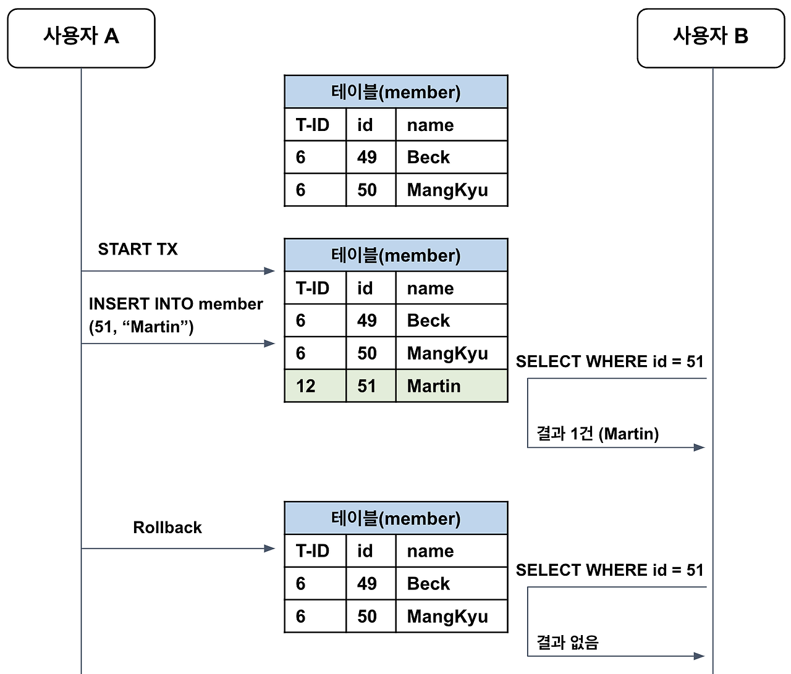
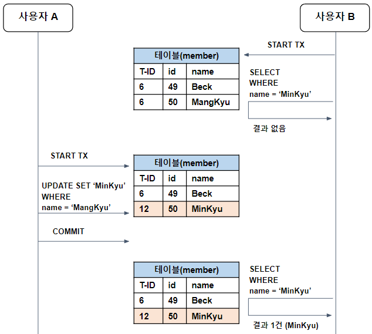
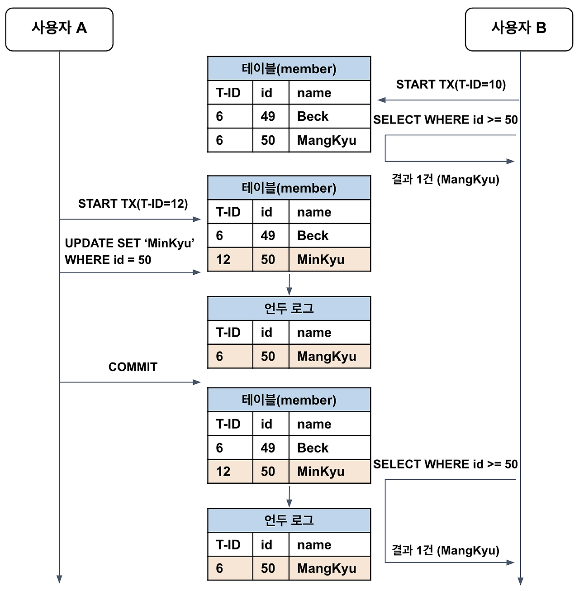
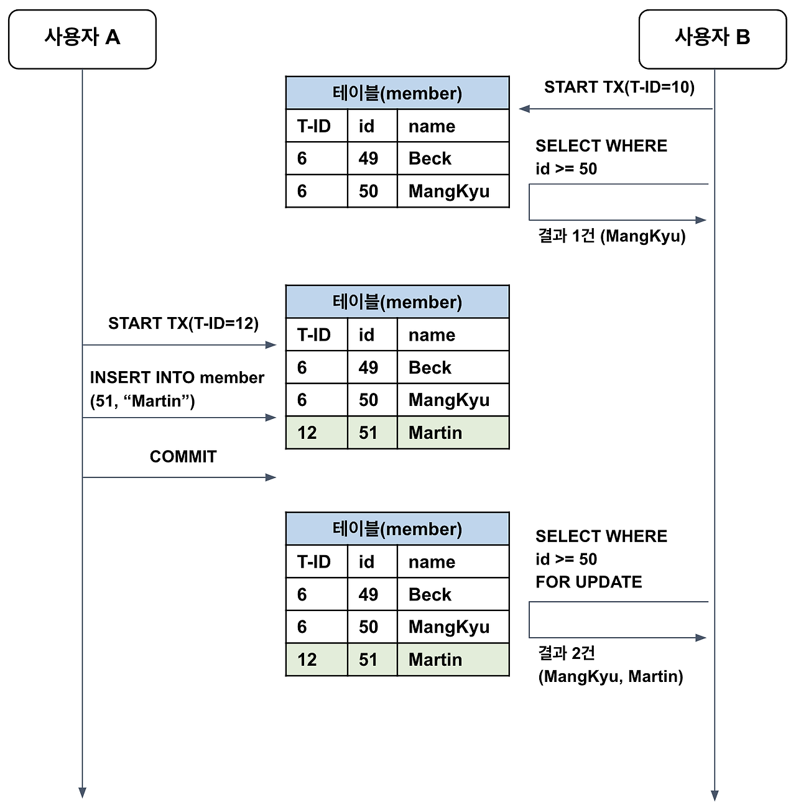

# Transaction

---

**데이터베이스의 상태를 변화시키기 위한 일련의 작업 단위이다.**

# 특징

---

트랜잭션에는 다음과 같은 **ACID** 성질이 있다.

-   **Atomicity(원자성)**

    -   트랜잭션의 모든 쿼리가 DB에 반영되거나, 모두 반영되지 않아야 한다.
        -   예: 계좌 이체 시 출금과 입금이 모두 성공하거나 모두 실패해야 한다. 출금만 성공하고 입금이 실패하는 상황이 발생하면 안 된다.

-   **Consistency(일관성)**

    -   트랜잭션의 처리 결과는 항상 일관성 있어야 한다.
        -   예: 은행 계좌 이체 시 총 잔고의 합은 트랜잭션 전후가 동일해야 한다. A가 B에게 5만원을 이체하면 A의 잔고는 5만원 감소하고 B의 잔고는 5만원 증가해야 한다.

-   **Isolation(독립성)**

    -   서로 다른 트랜잭션은 서로의 연산에 개입할 수 없다.
        -   예: 사용자 A와 B가 동시에 같은 상품을 구매할 때, 각 트랜잭션은 독립적으로 처리되어 재고 감소와 주문 처리가 올바르게 이루어져야 한다.

-   **Durability(지속성)**
    -   트랜잭션이 성공적으로 처리되었다면 그 결과는 영구 반영되어야 한다.
        -   예: 은행 이체가 완료된 후 시스템이 다운되더라도, 재시작 후에도 이체 내역이 보존되어야 한다.

# 기본 기능

---

-   **commit**
    -   DB의 트랜잭션이 성공적으로 수행되었으며 이를 반영하도록 하는 명령이다.
-   **rollback**
    -   DB 트랜잭션에서 문제가 발생했을 때, 실행 이전 상태로 되돌리는 명령이다.

# 트랜잭션 격리 수준

---

1. **Uncommitted Read(커밋되지 않은 읽기)**

    - 다른 트랜잭션에서 커밋되지 않은 데이터에도 접근할 수 있게 해주는 격리 수준이다.
    - **문제점**: Dirty Read - 커밋되지 않은 트랜잭션에 접근해 아직 정상 반영되지 않은 데이터(해당 데이터는 롤백되어 없어질 수 있음)를 읽는 현상이 발생할 수 있다.

2. **Committed Read(커밋된 읽기)**

    - 다른 트랜잭션에서 커밋된 데이터에만 접근할 수 있게 해주는 격리 수준이다.
    - **문제점**: Non-Repeatable Read - 하나의 트랜잭션에서 동일한 SELECT 쿼리를 실행했을 때 커밋 전의 데이터, 커밋 된 후의 데이터가 읽히면서 다른 결과가 조회되는 현상이 발생할 수 있다.

3. **Repeatable Read(반복 가능한 읽기)**

    - 커밋된 데이터만 읽을 수 있으며, 자신의 트랜잭션이 시작된 시점을 기준으로 데이터를 읽는 격리 수준이다.
    - MVCC를 통해 Undo 로그를 기반으로 동일한 데이터가 조회되도록 보장한다(Non-Repeatable Read 문제 해결).
    - **문제점**: Phantom Read - 하나의 트랜잭션 내에서 동일한 SELECT 쿼리의 결과 레코드 수가 달라지는 현상이 발생할 수 있다.

4. **Serializable**
    - 모든 트랜잭션을 순차적으로 실행시키는 격리 수준이다.
    - 트랜잭션이 서로 끼어들 수 있는 상황이 없으므로 데이터의 부정합 문제는 발생하지 않는다.
    - **단점**: 트랜잭션이 동기적으로 처리되면서 처리 속도 저하가 발생한다.
    - 다른 트랜잭션이 접근하려는 데이터에 대해 공유 잠금(Shared Lock)을 설정하므로 동시성이 크게 저하되고, 데드락 문제가 발생할 가능성이 높다.

# 격리 수준별 시나리오

---

## 1. Uncommitted Read

**시나리오**:

1. 사용자 A가 유저(51) 생성 (커밋x)
2. 사용자 B가 유저(51) 조회 (결과 1)
3. 사용자 A가 유저(51) 롤백
4. 사용자 B가 유저(51) 다시 조회 (결과 x)

**결론**: Uncommitted Read에서는 커밋, 롤백 이후 데이터가 사라지거나 생기게 되며 이를 **Dirty Read**라고 한다.

## 2. Committed Read

**시나리오**:

1. 사용자 B가 사용자(Minkyu) 조회 (결과 x)
2. 사용자 A가 사용자(Mankyu -> Minkyu) 업데이트
3. 사용자 B가 사용자(Minkyu) 다시 조회 (결과 1)

**결론**: Uncommitted Read 레벨에서 발생한 Dirty Read 현상은 방지되지만, Committed Read에서는 다른 트랜잭션의 커밋 여부에 따라 조회 결과가 달라질 수 있으며, 이를 **Non-Repeatable Read**라고 한다.

## 3. Repeatable Read

**시나리오** (사용자 A = Transaction 12, 사용자 B = Transaction 10):

1. 사용자 B가 user(50) 조회
2. 사용자 A가 user(50) 이름 업데이트
3. 사용자 A가 변경 사항 커밋
4. 사용자 B가 user(50) 다시 조회 (1번 이름과 동일)

**결론**: Committed Read 레벨에서 발생한 Non-Repeatable Read 현상이 방지되고 같은 트랜잭션에서 일관된 결과를 보장받게 된다.

**Repeatable Read의 특징**:

-   먼저 실행된(사용자B) 트랜잭션의 데이터만을 조회한다.
-   테이블에 자신보다 이후에 실행된 트랜잭션의 데이터가 존재한다면 언두 로그를 참고해서 데이터를 조회한다.
    -   `3. 사용자 A 변경 사항 커밋` 이후 `사용자 B가 다시 조회`를 하였지만 언두 로그를 참고하여 동일한 결과를 조회한다.

**Phantom Read 현상**:

-   Repeatable Read는 데이터의 추가까지는 막지 못하여 Select 이후 다른 트랜잭션에 의해 추가된 레코드가 발견될 수 있는데 이를 **Phantom Read**라고 한다.
-   일반적인 조회에서는 언두 로그를 통해 일관성을 유지하지만, 특정 상황(SELECT FOR UPDATE와 같은 잠금 읽기)에서는 언두 로그가 아닌 실제 테이블 데이터를 읽게 된다.
-   이 경우 다른 트랜잭션에 의해 추가된 레코드가 조회될 수 있다.

**Phantom Read 시나리오**:

1. 사용자 B가 user(id >= 50) 조회 (잠금x)
2. 사용자 A가 user(51) 생성
3. 사용자 B가 user(id >= 50) 조회 (잠금o) ← 언두 로그가 아닌 테이블 레코드 조회

**참고**: 이와 같은 경우는 특수한 상황에서만 발생하므로 극히 드물다.

# 결론

---

-   트랜잭션은 ACID의 성질을 가지고 있으며 각 성질은 원자성, 일관성, 독립성, 지속성이다.
-   트랜잭션의 격리 레벨은 Read Uncommitted, Read Committed, Repeatable Read, Serializable가 있다.
-   Read Uncommitted(커밋되지 않은 읽기)는 다른 트랜잭션에서 커밋되지 않은 데이터도 읽을 수 있다. 이로 인해 Dirty Read 문제가 발생할 수 있다
-   Read Committed(커밋된 읽기)는 커밋된 데이터만 읽을 수 있어 Dirty Read 문제는 해결되지만, 하나의 트랜잭션 내에서 같은 쿼리를 여러 번 실행할 때 다른 결과가 나오는 Non-Repeatable Read 문제가 발생할 수 있다.
-   Repeatable Read(반복 가능한 읽기)는 트랜잭션이 시작된 시점의 데이터를 기준으로 일관된 읽기를 보장하여 Non-Repeatable Read 문제를 해결되지만, 특정 상황에서 Phantom Read 문제가 발생할 수 있다.
-   Serializable(직렬화 가능)은 가장 높은 격리 수준으로, 모든 트랜잭션을 순차적으로 실행하여 모든 데이터 불일치 문제를 해결하지만, 동시성이 크게 저하되고 데드락 가능성이 높아진다.

# 참고 자료

---

-   https://mangkyu.tistory.com/299
